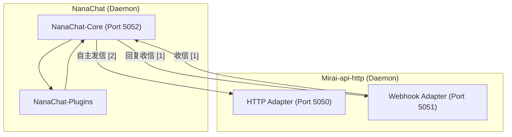
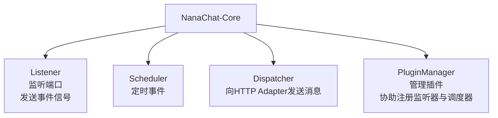

# NanaChat-Core

## Dependencies 前期调研

### mirai & mirai-api-http

Mirai 是一个在全平台下运行，提供 QQ Android 和 TIM PC 协议支持的高效率机器人框架.

https://github.com/project-mirai/mirai-api-http

#### 下载与设置守护进程

+ 安装 Java 运行时 `sudo apt install openjdk-11-jre`
+ 下载 MCL，安装 mirai-api-http
+ 登录 Bot（使用 QQ 浏览器验证？使用 QQ 打开链接即可）
  + 如果有需要的话可以安装验证码库
+ 设置为自动登录

+ 配置 supervisor

```conf
[program:mcl]
command=/home/ftpuser/5050-mcl/mcl-1.2.2/mcl
autostart=true
autorestart=true
user=root
```


### Brainstorming 项目构思

我们可以考虑采用 http 和 webhook 两种 adapter，分别模拟主动发信和事件处理.





## Docs

### Nana-Core

### Nana-Plugins

注册 Nana-Core::Listener

使用 Nana-Core::Dispatcher
